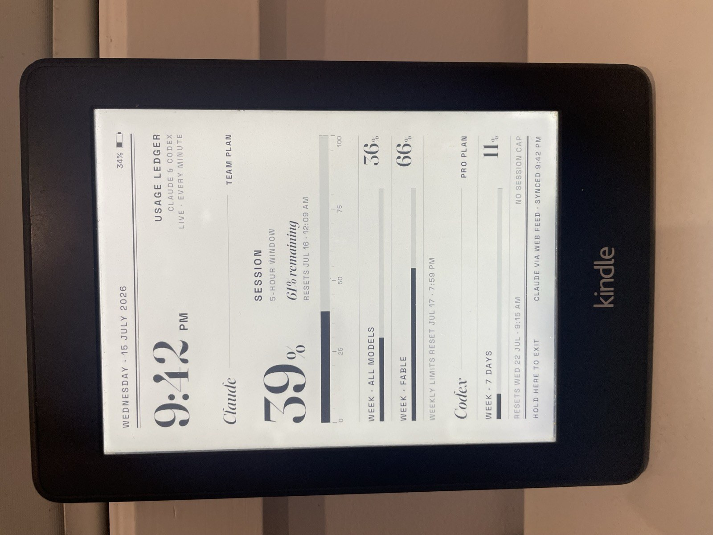
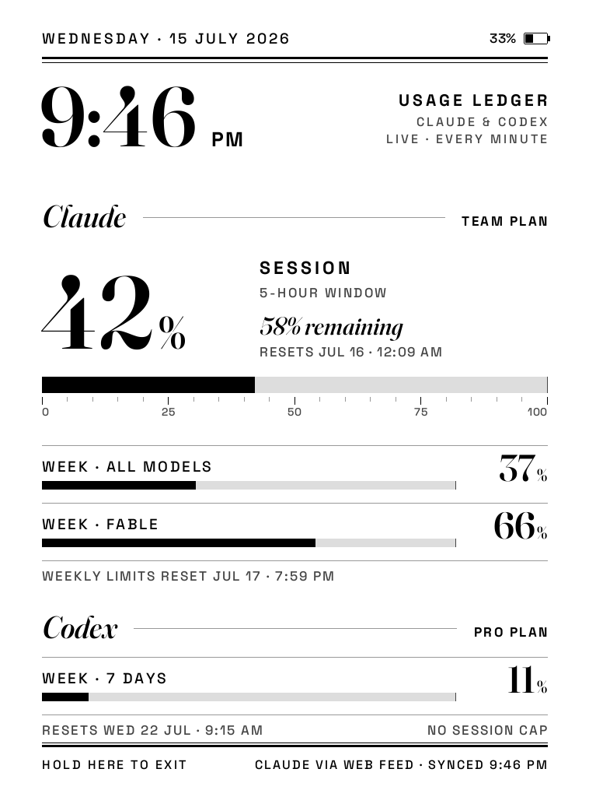

# Kindle Usage Ledger

A jailbroken Kindle Paperwhite living a second life as a live, always-on e-ink dashboard for my
Claude and Codex usage limits — typeset like a broadsheet, updated every minute, powered by a
small Python server on my Mac.

<p align="center">
  
</p>

## Why

AI subscription plans meter usage in rolling windows (a 5-hour session, a 7-day week), and the
numbers live in places you never look until you hit a wall mid-task. An e-ink screen on the desk
turns them into ambient information: one glance tells you how much runway you have and when it
comes back.

And since a 212-ppi e-ink panel is closer to paper than to a monitor, the design leans into
print rather than dashboard-widget conventions: a dateline and double rule, a display-serif
clock, italic section headings, oversized Fraunces numerals, letterspaced Space Grotesk labels,
and bar meters with measured tick rulers. No rings, no gradients, no chrome.

<p align="center">
  
</p>

## How it works

```
Chrome extension ──POST /api/claude──▶                      ┌──────────────┐
  (reads claude.ai usage from the      Python server on Mac │  screen.png  │
   signed-in session, every minute)     · renders PNG       └──────┬───────┘
                                        · collects Codex           │ polled every 30 s
Codex app-server ──rate limits───────▶  · serves /api/display      ▼
  (local JSON-RPC over stdio)                               KOReader plugin on the
                                                            jailbroken Kindle (TRMNL-style)
```

**The server** (`dashboard/usage_dashboard.py`, no dependencies beyond Pillow) renders a
758 × 1024 grayscale PNG once a minute and exposes a tiny HTTP API. Every gray in the palette is
a multiple of 17, so values map 1:1 onto the Kindle's 4-bit framebuffer with no dithering
surprises.

**Claude usage** comes from a minimal Chrome extension (`extension/`) that reads the usage
endpoint through the already-signed-in claude.ai session and posts it to the server — no
credentials stored anywhere. If the browser feed goes stale, the server falls back to scraping
`claude /usage` through a pty.

**Codex usage** is collected locally by speaking JSON-RPC to the Codex app-server binary over
stdio.

**The Kindle** runs KOReader with a modified copy of
[TRMNL's official KOReader plugin](https://github.com/usetrmnl/trmnl-koreader) (MIT,
`kindle/trmnl.koplugin/`) that polls the server, redraws the frame, keeps the device awake while
the dashboard is active, refreshes on tap, and exits on a long-press of the footer so you can
never get trapped in the full-screen view.

**The typography** is cut from variable fonts at build time
(`dashboard/fonts/fetch_fonts.sh`): Fraunces at its 144-pt optical size for the masthead clock
and the big numerals, Space Grotesk for everything set in caps. Both are SIL Open Font License.

## Running it yourself

You need: a jailbroken Kindle with KOReader, a Mac that stays awake, Python 3.11+ with Pillow
and fonttools, and Chrome signed in to claude.ai.

1. `dashboard/fonts/fetch_fonts.sh` — download and cut the typefaces.
2. Set your org id in `extension/background.js`, pick a token, and load `extension/` as an
   unpacked extension in Chrome.
3. Set the same token in the LaunchAgent plist (`dashboard/com.example.ai-usage-kindle.plist`),
   fix the paths, and load it with `launchctl`.
4. Copy `kindle/trmnl.koplugin/` into KOReader's plugins directory on the Kindle, point
   `base_url` at your Mac, and put the token in `apikey.txt` next to the plugin.

The server binds to your LAN, authenticated by a shared token; the Kindle's own maintenance
access stays key-only SSH. Nothing here talks to the internet except claude.ai from your own
browser session.

## Status

Running continuously on my desk. Battery lasts a long time even with the panel refreshing every
30 seconds — e-ink only spends power on the redraw.
